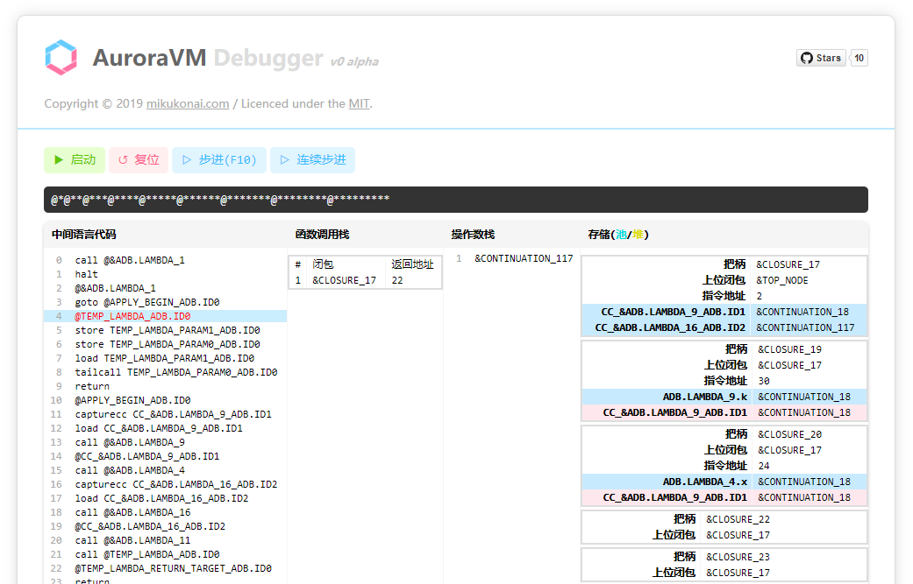

<p align="center"></p>

<h1 align="center">AuroraScheme</h1>

 


**AuroraScheme**是一款[Scheme](https://zh.wikipedia.org/wiki/Scheme)语言实现，能够将Scheme编译为中间语言代码，并且在虚拟机上执行中间语言代码。AuroraScheme基于Node.js开发，你可以使用JavaScript或者TypeScript编写“本地函数库”，以扩展AuroraScheme的功能。

**AuroraScheme** is an implementation of [Scheme](https://en.wikipedia.org/wiki/Scheme_(programming_language)) programming language. It consists of two parts: a compiler and a virtual machine. The compiler compiles Scheme source code to intermediate language code, and the VM executes the compiled IL code. AuroraScheme is based on Node.js, so that you can write "native libraries" in JavaScript or TypeScript to extend the functionality of AuroraScheme.

## 可视化演示 / Visual demonstration

请克隆仓库到本地，执行`node ./source/AuroraScheme.js`，使用浏览器访问`http://localhost:8088/`即可。 / Please clone this repo to your computer, run `node ./source/AuroraScheme.js`, and use your browser to visit `http://localhost:8088/`.



## 构建 / Building

依赖项 / Dependencies：

- Node.js v10+
- TypeScript 3+

```
cd ./source
tsc --out AuroraScheme.js
node AuroraScheme.js
```

## 特性 / Features

### Scheme语言特性 / Scheme language features

- 支持Scheme核心子集，包括作为值的函数、词法作用域和列表操作。 / Supports core subset of Scheme, including first-class function, lexical scope and list processing.
- 支持一等续延（continuation）和`call/cc`。 / Supports first-class continuation and `call/cc`.
- 暂不支持卫生宏和模式匹配。 / Hygienic macros not supported yet.
- 尾调用优化。 / Tail call optimization.
- 支持模块化开发，可检测并管理模块间依赖关系。 / Modular Scheme development. Dependency management supported.

### 运行时系统 / Runtime system

- Scheme代码将被编译为中间语言代码，在基于栈的虚拟机上运行。 / Scheme code will be compiled to IL code. The compiled IL code will run on a stack-based virtual machine.
- 基于标记-清除算法的垃圾回收。 / Mark-and-sweep GC.
- 支持虚拟机层次上的多进程。支持“端口”机制以实现进程间通信。 / Supports VM-level "multi-process" mechanism. Supports "port" mechanism for inter-process communication.

### 标准库和可扩展性 / Standard library and extendibility

- 通过模块机制，提供基本的函数库，称为标准库。
- 提供类似于JNI的本地接口机制，可以使用TypeScript/JavaScript编写供Scheme代码调用的Native库，实现AuroraScheme与宿主环境（Node.js）的互操作，例如文件读写、网络收发等。
- 并**不打算完全严格遵守R<sup>5</sup>RS标准**，将按个人需要实现若干标准库函数。

## 计划实现的特性和功能 / Planned features

|Features|Priority|Status|
|----|-----|----|
|可视化调试工具 / Visual debugger|★★★|开发中|
|卫生宏和模式匹配 / Hygienic macros & Pattern matching|★★★|研究中|
|字符串模板和正则表达式 / Template string & Regex|★★★|开发中|
|完善设计文档和用户手册 / Documentation|★★☆|开发中|
|数值类型塔（数学库） / Math lib|★★☆|计划中|
|Canvas/SVG图形库 / Canvas/SVG Graphic lib|★★☆|计划中|
|R<sup>n</sup>RS尽量兼容 / Compatibility with R<sup>n</sup>RS|★☆☆|研究中|
|持续集成和自动化测试 / CI & Auto test|★☆☆|计划中|
|较高级的编译优化 / Advanced compiling optimization|★☆☆|计划中|
|用C语言重构VM / VM Refactoring in C|★☆☆|开发中|
|自动CPST&自动柯里化 / Auto CPST & Currying|★☆☆|计划中|
|类型系统 / Type system embedding|★☆☆|计划中|

### 开发目标 / Development Goals

- 通过持续改进，打造成一套个人自用的脚本工具。
- 学习研究目的。

## 示例 / Examples

### 词法作用域 / Lexical scope

```scheme
(define free 100)

(define foo
  (lambda () free))

(define bar
  (lambda (free)
    (foo)))

(display (bar 200))
;; 输出100，而不是200
```

### 函数作为一等公民 / Function as first-class citizen

```scheme
(define eval
  (lambda (f a b)
    (f a b)))

(display (eval * 30 40)) ; 1200
(display (eval (lambda (x y) (/ (+ x y) 2)) 30 40)) ; 35
```

### 列表操作 / LISt Processing

```scheme
(define hello '(hello aurora scheme))

(define iterate
  (lambda (lst)
    (if (null? lst)
        #f
        {
            (display (car lst))
            (iterate (cdr lst))
        })))

(iterate hello) ; hello aurora scheme
```

### 续延和`call/cc` / Continuation and `call/cc`

```scheme
;; Yin-yang puzzle
;; see https://en.wikipedia.org/wiki/Call-with-current-continuation

(((lambda (x) (begin (display "@") x)) (call/cc (lambda (k) k)))
 ((lambda (x) (begin (display "*") x)) (call/cc (lambda (k) k))))

; @*@**@***@**** ...
```

更多测试用例，请参考[`/testcase`](https://github.com/mikukonai/AuroraScheme/tree/master/testcase)。 / For more test cases, please refer to [`/testcase`](https://github.com/mikukonai/AuroraScheme/tree/master/testcase).

## 形式语法（BNF表示） / Formal syntax (BNF notation)

```
    <SourceCode> ::= (lambda () <TERM>*) CRLF
          <Term> ::= <SList> | <Lambda> | <Quote> | <Unquote> | <Quasiquote> | <Symbol>
         <SList> ::= ( <SListSeq> )
      <SListSeq> ::= <Term> <SListSeq> | ε
        <Lambda> ::= ( lambda <ArgList> <Body> )
       <ArgList> ::= ( <ArgListSeq> )
    <ArgListSeq> ::= <ArgSymbol> <ArgListSeq> | ε
     <ArgSymbol> ::= <Symbol>
          <Body> ::= <BodyTerm> <Body_>
         <Body_> ::= <BodyTerm> <Body_> | ε
      <BodyTerm> ::= <Term>
         <Quote> ::= ' <QuoteTerm> | ( quote <QuoteTerm> )
       <Unquote> ::= , <UnquoteTerm> | ( unquote <QuoteTerm> )
    <Quasiquote> ::= ` <QuasiquoteTerm> | ( quasiquote <QuoteTerm> )
     <QuoteTerm> ::= <Term>
   <UnquoteTerm> ::= <Term>
<QuasiquoteTerm> ::= <Term>
        <Symbol> ::= SYMBOL
```

## 文档 / Documentation

- [设计笔记 / Design Notes](https://mikukonai.com/template.html?id=AuroraScheme%E8%AE%BE%E8%AE%A1%E7%AC%94%E8%AE%B0)
- [开发规约 / Development Regulation](https://github.com/mikukonai/AuroraScheme/blob/master/CONTRIBUTING.md)

## 权利声明 / Licence

版权所有 &copy; 2019 Mikukonai@GitHub，保留所有权利。 / Copyright &copy; 2019 Mikukonai@GitHub. All rights reserved.

采用MIT协议授权。 / Licenced under MIT.

本系统为个人以学习和自用目的所创作的作品。作者不对此系统的质量作任何承诺，不保证提供任何形式的解释、维护或支持，也不为任何人使用此系统所造成的任何正面的或负面的后果负责。 / This system is developed by the author for learning and personal use purposes. The author does not make any commitment to the quality of this system, and does not warrant the provision of any form of interpretation, maintenance or support, and is not responsible for any positive or negative consequences of any use of this system by anyone.